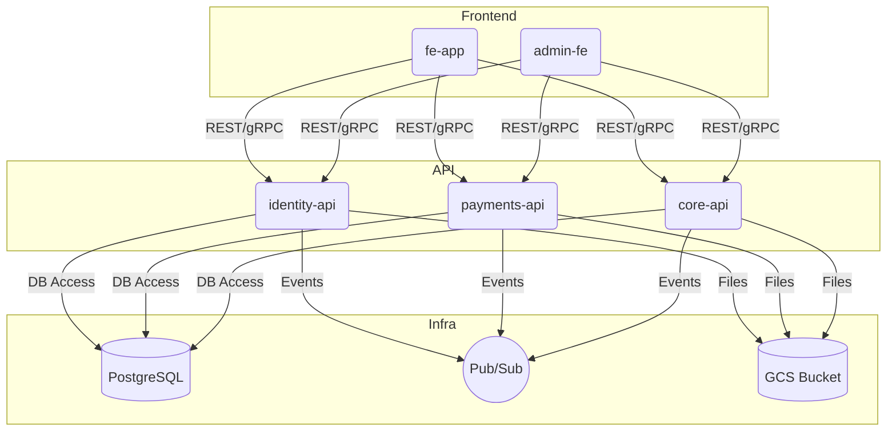

# ☸️ Full Clean Architecture Example: Microservices on GCP with Kubernetes & DevOps

This guide shows how to use the provided `devops/` structure to deploy a production-grade microservices system on GCP, following clean architecture principles. The example includes:

- **Microservices:** `identity-api`, `payments-api`, `core-api`
- **Frontends:** `fe-app` (user), `admin-fe` (admin dashboard)
- **Database:** PostgreSQL
- **Queue/Event:** Google Pub/Sub
- **Storage:** Google Cloud Storage
- **DevOps:** Kubernetes, Helm, Terraform, ArgoCD, CI/CD, GitOps

---

## 🗂️ Directory Structure

```
devops/
  k8s/
    base/           # Base manifests for all services
    overlays/       # dev, staging, prod overlays
    ingress/        # Ingress configs
  helm/             # Helm charts (optional)
  scripts/          # Automation scripts
  terraform/
    gcp/            # GCP infra as code
  argocd/           # ArgoCD app manifests
  flux/             # FluxCD (optional)
  tools.md          # Tooling overview
```

---

## 🏗️ Step-by-Step: From Infra to Production

### 1. Provision GCP Infrastructure (Terraform)

- Use `devops/terraform/gcp/` to create:
  - GKE cluster
  - Cloud SQL (Postgres)
  - Pub/Sub topics/subscriptions
  - Storage buckets
  - VPC, IAM, DNS, etc.

### 2. Build & Push Docker Images

- Use `devops/scripts/build-images.sh` to build and push images for each service:
  - `identity-api`, `payments-api`, `core-api`, `fe-app`, `admin-fe`

### 3. Configure Kubernetes Manifests

- In `devops/k8s/base/`, create a `deployment.yaml` and `service.yaml` for each service.
- Use `devops/k8s/base/postgres-service.yaml`, `pubsub-service.yaml`, etc. for infra services.
- Use `devops/k8s/base/my-service-hpa.yaml` for autoscaling.
- Use `devops/k8s/base/my-service-lb.yaml` or `ingress/ingress.yaml` for load balancing and routing.

### 4. Overlays for Environments

- Use `devops/k8s/overlays/dev/`, `staging/`, `prod/` to patch images, replicas, and env-specific config.

### 5. Secrets & Config

- Store secrets in GCP Secret Manager or use SOPS + `update-secrets.sh`.
- Mount secrets/configs in deployments.

### 6. GitOps & CI/CD

- Use ArgoCD (`devops/argocd/`) or FluxCD (`devops/flux/`) to sync manifests from Git to cluster.
- Use GitHub Actions for CI (build, test, push images, update manifests).

### 7. Monitoring & Security

- Deploy Prometheus, Grafana, Loki, Trivy, OPA, etc. as needed.

---

## 🗺️ System Architecture (Mermaid)



---

## 🚀 What to Use from This Repo

- **Terraform:** Provision GCP infra (`terraform/gcp/`)
- **Docker:** Build images for all services
- **K8s Manifests:** Deploy all services, DB, queue, storage
- **Overlays:** Separate config for dev/staging/prod
- **Ingress:** Route traffic to APIs and FEs
- **Helm:** Use for templating if needed
- **ArgoCD/Flux:** GitOps for continuous deployment
- **Scripts:** Automate build, deploy, secrets
- **tools.md:** Reference for all DevOps tools

---

## 📝 Best Practices

- Use overlays for environment config
- Use secrets management (never commit secrets)
- Use HPA for autoscaling
- Use GitOps for safe, auditable deployments
- Monitor and secure your cluster

---

MIT – use and adapt freely.
